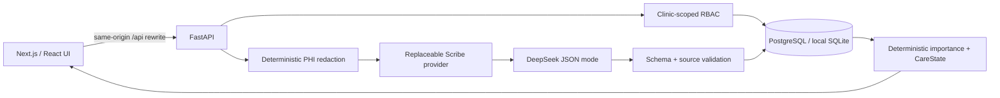

# Nightingale Care Note

Nightingale Care Note is a local-first longitudinal care-record prototype built for the Nightingale 72HR Build. It uses synthetic data only and is organised around three questions:

1. What matters now?
2. Where did the information come from?
3. Who reviewed, changed, or acted on it?

> **Safety notice:** This prototype is not for real patient data, clinical diagnosis, treatment, or medical decision-making.

## Product overview

Longitudinal records grow across consultations, follow-up calls, patient reports, and team collaboration. Important risks, recent changes, open work, and conflicting information can become buried in the timeline. Free-form AI summaries can also lose provenance, permissions, and human-review boundaries.

Nightingale preserves the complete Timeline as the record of events and adds an explainable, traceable Care Glance view for current priorities.

- **Timeline is the record:** manual and AI-assisted entries retain comments, immutable versions, on-demand diffs, and append-only revert.
- **Care Glance is a deterministic read model:** it queries structured state and never invokes the LLM during reads.
- **AI extracts only supported information:** DeepSeek output must satisfy a typed schema, and every source quote must exist in the redacted transcript.
- **Clinical authority remains human:** AI suggestions cannot confirm themselves; only a clinician can review highlights and resolve conflicts.
- **Every priority remains traceable:** `Highlight -> ClinicalFact -> Entry -> ConsultSession` preserves the evidence chain.

The fixed demo story follows the fully synthetic patient Sarah Lim across several months. It covers a persistent allergy, worsening chest pressure, an Atorvastatin dose discrepancy, team comments, manual notes, and revision recovery.

## Architecture



```text
raw transcript (local database only)
  -> deterministic PHI redaction
  -> replaceable DeepSeek provider
  -> Pydantic schema and source-quote validation
  -> Entry / ClinicalFact / Task / Highlight / Conflict
  -> rule-driven Care Glance
```

## Tech stack

- Frontend: Next.js 16, React 19, TypeScript, Tailwind CSS, TanStack Query
- Backend: Python 3.11+, FastAPI, SQLAlchemy 2, Pydantic v2, Alembic, psycopg
- Database: PostgreSQL/Supabase in the hosted configuration; SQLite for zero-configuration local review
- LLM: DeepSeek behind a replaceable `ScribeProvider` abstraction
- Verification: pytest, Vitest, Testing Library, TypeScript, ESLint, and Next.js production build

## Repository layout

```text
backend/                       FastAPI application, migrations, seed, and tests
frontend/                      Next.js application and component/API tests
docs/demo-script.md            6-8 minute reviewer walkthrough
docs/requirements/             Canonical synthetic patient story
output/pdf/                    Two-to-three-page technical brief
scripts/                       Benchmark and document-generation utilities
ATTRIBUTION.txt                Third-party software and service attribution
```

## Quick start (local SQLite)

These commands work from any clone location. No database account or API key is required to review the core Timeline, Care Glance, RBAC, comments, and revision workflows.

### 1. Clone the repository

```bash
git clone https://github.com/QFAN04/nightingale-care-note.git
cd nightingale-care-note
```

### 2. Start the backend

Python 3.11, 3.12, or 3.13 is supported.

```bash
cd backend
python -m venv .venv
```

Activate the environment:

```powershell
# Windows PowerShell
.\.venv\Scripts\Activate.ps1
```

```bash
# macOS or Linux
source .venv/bin/activate
```

Install, migrate, seed, and run:

```bash
python -m pip install --upgrade pip
python -m pip install -e ".[dev]"
python -m alembic upgrade head
python -m app.seed.command
python -m uvicorn app.main:app --reload --port 8000
```

The health endpoint is `http://127.0.0.1:8000/health`; OpenAPI is available at `http://127.0.0.1:8000/docs`.

### 3. Start the frontend

Open a second terminal from the repository root:

```bash
cd frontend
npm ci
npm run dev
```

Open `http://localhost:3000`. The frontend rewrites same-origin `/api/*` requests to `http://127.0.0.1:8000` by default.

## Optional environment configuration

The repository runs locally without environment files. Create local files only when overriding the defaults. Real credentials must stay in `.env` or `.env.local`; both are ignored by Git.

### Backend: `backend/.env`

Copy `backend/.env.example` and edit only the values you need:

| Variable | Purpose | Default/example |
|---|---|---|
| `DATABASE_URL` | SQLAlchemy and Alembic connection | `sqlite+pysqlite:///./nightingale.db` |
| `DEEPSEEK_API_KEY` | Optional private DeepSeek key | local secret; never commit |
| `DEEPSEEK_BASE_URL` | Provider base URL | `https://api.deepseek.com` |
| `DEEPSEEK_MODEL` | Scribe model | `deepseek-v4-flash` |
| `DEEPSEEK_MAX_TOKENS` | Structured response limit | `2048` |
| `DEEPSEEK_TIMEOUT_SECONDS` | Provider timeout | `30` |

Without a DeepSeek key, all non-Scribe features remain available and Scribe fails closed with an explicit `503`. Automated tests use a deterministic fake provider and consume no DeepSeek tokens.

### Frontend: `frontend/.env.local`

`BACKEND_API_URL` optionally changes the server-side rewrite destination. Its default is `http://127.0.0.1:8000`. No database or DeepSeek credential is stored in the frontend.

## Supabase/PostgreSQL option

The submitted hosted configuration uses a dedicated Supabase PostgreSQL project. To use another PostgreSQL database:

1. Copy `backend/.env.example` to `backend/.env`.
2. Replace `DATABASE_URL` with your own SQLAlchemy psycopg connection string.
3. From `backend/`, run `python -m alembic upgrade head` and `python -m app.seed.command`.

All 13 public application tables and `public.alembic_version` have RLS enabled. The prototype intentionally uses deny-by-default RLS without permissive browser policies; FastAPI's clinic-scoped RBAC remains the application authorisation boundary.

## Synthetic demo data

From `backend/`:

```bash
python -m app.seed.command
```

The seed is idempotent and reports only `created` or `already present`; it does not print the transcript. To restore the canonical demo state after rehearsal:

```bash
python -m app.seed.command --reset-demo
```

The reset refuses to run when it finds a patient, clinic, or user outside the fixed Sarah fixture. Never use it on a database containing other data.

## Tests and verification

Backend, from `backend/`:

```bash
python -m pytest -q
python -m compileall -q app tests alembic ../scripts
python ../scripts/benchmark_glance.py
```

Frontend, from `frontend/`:

```bash
npm test
npm run typecheck
npm run lint
npm run build
```

The final measured local benchmark used 20 warmups and 200 requests. Care Glance P95 was 4.87 ms against the 300 ms target using FastAPI TestClient, SQLite, and the fixed synthetic dataset; it is a regression benchmark, not a hosted Supabase SLA.

## Security and trust boundaries

### PHI redaction

Before every LLM request, deterministic redaction covers known patient names and aliases, Singapore eight-digit phone numbers, and IC/ID-like identifiers. The provider receives only `redacted_transcript`. Every returned source quote is checked against that text. Logs and audit events exclude transcripts and full clinical content.

### RBAC

Requests use the synthetic demo identity header `X-Demo-User-ID`. Authorisation is enforced by FastAPI and constrained to the same clinic.

| Role | Prototype capabilities |
|---|---|
| Patient | Own patient scope; patient instructions and accepted Glance content; AI-patient Scribe |
| Staff | Same-clinic timeline; staff notes and their revisions; internal comments; nurse-patient Scribe |
| Clinician | Full same-clinic context; clinician-note revisions; Highlight review; Conflict resolution; doctor-patient Scribe |
| Admin | Read-only clinic view |

Cross-clinic lookups return `404` to reduce resource-enumeration leakage. UI hiding is never treated as an authorisation control.

### Revision model

Each update appends an immutable full snapshot. Diffs are calculated on demand, and revert appends another snapshot rather than deleting history. Updates require `expected_version`; stale writes return `409` and are never silently overwritten.

### Bounded self-learning

Care Glance ranking is deterministic. Clinician Accept/Reject feedback changes only a same-clinic learning bonus, clamped to `0..3`. It cannot modify a risk label, cross clinic boundaries, or bypass review. Persistent critical allergies do not decay; low-risk transient information may be marked as a compression candidate but is not deleted.

## Prototype trade-offs

- `X-Demo-User-ID` demonstrates server-enforced role boundaries but is not production authentication.
- RLS is deny-by-default because browsers never connect directly to clinical tables in this prototype.
- Full snapshots favour reliable audit, diff, and revert over storage compression.
- Conflict detection is deliberately limited to the supported medication-dose case.
- Voice capture, real patient data, public deployment, and automated medical advice are out of scope.
