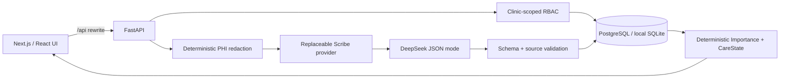

# Nightingale Care Note

Nightingale Care Note 是一个 local-first、仅使用合成数据的纵向照护记录原型，面向 Nightingale 72HR Build。它不是通用聊天机器人，也不是通用文档工具；产品始终围绕三个问题：

1. 现在最重要的事情是什么？
2. 这条信息来自哪里？
3. 谁确认、修改或处理过它？

> 安全声明：本仓库只允许使用合成患者数据，不可用于真实临床诊断、治疗或医疗决策。

## Problem

长期照护记录会随着就诊、电话随访、患者自述和团队协作不断增长。重要风险、近期变化、待办和互相矛盾的信息容易被埋在时间线里，同时 AI 摘要又可能失去来源、权限和人工复核边界。

Nightingale 将完整 Timeline 保留为事实记录，并用一个可解释、可追溯的 Care Glance 读模型回答“现在先看什么”。

## Product concept

- **Timeline 是记录主线**：保存人工记录与 AI 处理结果，支持版本、diff 和追加式 revert。
- **Care Glance 是运行时读模型**：只查询结构化状态，不在读取时调用 LLM，也不单独持久化 CareState 表。
- **AI 只提取有证据的信息**：DeepSeek 输出必须符合结构化 schema，source quote 必须能在脱敏 transcript 中精确定位。
- **临床判断由人掌控**：AI suggestion 不能自行变成 clinician-confirmed；只有 clinician 能接受/拒绝建议和解决冲突。
- **每个重点都能回到来源**：`Highlight → ClinicalFact → Entry → ConsultSession` 保留精确引用链。

固定演示故事是完全合成的 Sarah Lim 跨月照护记录，覆盖青霉素过敏、胸部压迫感变化、Atorvastatin 剂量冲突、团队评论和版本恢复。

## Architecture



关键数据流：

```text
raw transcript（仅本地数据库）
  → 确定性 PHI 脱敏
  → DeepSeek provider abstraction
  → Pydantic schema 与 source quote 校验
  → Entry / ClinicalFact / Task / Highlight / Conflict
  → 规则驱动的 Care Glance
```

## Tech stack

- Frontend: Next.js 16、React 19、TypeScript、Tailwind CSS、TanStack Query
- Backend: Python 3.11+、FastAPI、SQLAlchemy 2、Pydantic v2、Alembic、psycopg
- Database: 独立 Supabase PostgreSQL 项目；本地快速开发可使用 SQLite
- LLM: DeepSeek，经可替换 `ScribeProvider` 抽象接入
- Verification: pytest、Vitest、Testing Library、TypeScript、ESLint、Next.js production build

## Setup

仓库固定在：

```text
D:\nightingale-care-note
```

后端（PowerShell）：

```powershell
cd D:\nightingale-care-note\backend
py -3.12 --version
py -3.12 -m venv .venv
.\.venv\Scripts\python.exe -m pip install --upgrade pip
.\.venv\Scripts\python.exe -m pip install -e ".[dev]"
Copy-Item .env.example .env
```

前端：

```powershell
cd D:\nightingale-care-note\frontend
npm ci
Copy-Item .env.example .env.local
```

所有真实凭证只能放在本地 `.env` / `.env.local`；这些文件已被 Git 忽略。

## Environment

后端 `backend/.env`：

| 变量 | 用途 | 本地示例 |
|---|---|---|
| `DATABASE_URL` | SQLAlchemy / Alembic 数据库连接 | `sqlite+pysqlite:///./nightingale.db` |
| `DEEPSEEK_API_KEY` | DeepSeek 私密 API key | 只填写真实本地值 |
| `DEEPSEEK_BASE_URL` | provider base URL | `https://api.deepseek.com` |
| `DEEPSEEK_MODEL` | scribe 模型名 | `deepseek-v4-flash` |
| `DEEPSEEK_MAX_TOKENS` | 单次结构化输出上限 | `2048` |
| `DEEPSEEK_TIMEOUT_SECONDS` | provider 超时 | `30` |

前端 `frontend/.env.local`：

| 变量 | 用途 | 默认值 |
|---|---|---|
| `BACKEND_API_URL` | Next.js 服务端 API rewrite 目标 | `http://127.0.0.1:8000` |

前端环境中不存放 DeepSeek 或数据库凭证。

## Supabase setup

必须使用独立项目 `nightingale-care-note`，不要修改其他项目（尤其是 `chat-langchain-study`）。

1. 在 Supabase 项目设置中复制 PostgreSQL connection string。
2. 将密码与项目 ref 填入本地 `backend/.env` 的 `DATABASE_URL`，不要提交该文件。
3. 应用迁移：

```powershell
cd D:\nightingale-care-note\backend
.\.venv\Scripts\python.exe -m alembic upgrade head
```

所有 13 张 `public` 表都启用了 RLS。第一版采用 **deny-by-default**：不创建客户端放行 policy，浏览器不能直接读写临床表；FastAPI 的 clinic-scoped RBAC 是业务授权边界。不要为了消除 Supabase Advisor 的 `RLS Enabled No Policy` INFO 而创建宽松 policy。

## DeepSeek setup

把真实 key 写入 `backend/.env`：

```dotenv
DEEPSEEK_API_KEY=your-local-secret
DEEPSEEK_MODEL=deepseek-v4-flash
```

不要把 key 写进 Python、TypeScript、README、提交记录或聊天。没有配置 key 时，普通 Timeline / Glance 功能仍可运行；调用 Scribe 会明确返回 `503`。自动测试使用确定性 fake provider，不消耗 DeepSeek token。

## Run backend

先应用迁移并写入合成故事，再启动 FastAPI：

```powershell
cd D:\nightingale-care-note\backend
.\.venv\Scripts\python.exe -m alembic upgrade head
.\.venv\Scripts\python.exe -m app.seed.command
.\.venv\Scripts\python.exe -m uvicorn app.main:app --reload --port 8000
```

健康检查：`http://127.0.0.1:8000/health`；OpenAPI：`http://127.0.0.1:8000/docs`。

## Run frontend

另开一个 PowerShell 窗口：

```powershell
cd D:\nightingale-care-note\frontend
npm run dev
```

打开 `http://localhost:3000`。前端通过同源 `/api/*` 请求转发到 `BACKEND_API_URL`。

## Demo and submission

- 完整的 6–8 分钟录制流程见 [`docs/demo-script.md`](docs/demo-script.md)。主演示全部通过 Nightingale UI 完成，不需要使用 Swagger 修改记录。
- Demo Video：**待实际录制并上传后，在此填写最终链接**。在链接可访问前，不应把项目标记为 submission-ready。
- 提交材料还包括 [`output/pdf/nightingale-technical-brief.pdf`](output/pdf/nightingale-technical-brief.pdf) 与 [`ATTRIBUTION.txt`](ATTRIBUTION.txt)。

演示时，Staff/Clinician 可使用 **Add note** 创建角色派生的人工记录；Timeline 中的 **Version history** 可查看完整快照、比较任意两个版本、保存新 revision，并以追加新快照的方式 revert。AI Scribe 的 interaction type 由当前身份自动锁定，Admin 不显示 Scribe 操作。

## Seed synthetic data

```powershell
cd D:\nightingale-care-note\backend
.\.venv\Scripts\python.exe -m app.seed.command
```

命令只写入固定 Sarah Lim 合成故事，并且幂等：重复运行不会重复插入。输出只报告 created / already present，不打印 transcript。

## Tests

后端：

```powershell
cd D:\nightingale-care-note\backend
.\.venv\Scripts\python.exe -m pytest -q
.\.venv\Scripts\python.exe -m compileall -q app tests alembic ..\scripts
.\.venv\Scripts\python.exe ..\scripts\benchmark_glance.py
```

前端：

```powershell
cd D:\nightingale-care-note\frontend
npm test
npm run typecheck
npm run lint
npm run build
```

## PHI redaction

每次 LLM 调用前都执行确定性脱敏。第一版至少识别：

- 已知患者姓名与 alias
- 新加坡 8 位电话号码
- IC / ID-like 标识

原始 transcript 只保留在本地数据库；provider 只收到 `redacted_transcript`。系统还会验证每个 AI `source_quote` 确实存在于脱敏文本中。普通日志和 AuditEvent 都不记录 transcript 或完整临床正文。

## RBAC enforcement

请求使用演示身份 header：

```text
X-Demo-User-ID: <uuid>
```

授权在 FastAPI 服务端执行，并始终限制到同一 clinic：

| Role | 第一版能力 |
|---|---|
| Patient | 只访问自己的患者范围；只看 patient instruction 与已接受的 Glance 内容；可发起 AI-patient Scribe |
| Staff | 查看同 clinic 时间线；新增/编辑 staff note；查看版本、diff/revert 自己类型的记录；内部评论；发起 nurse-patient Scribe |
| Clinician | 查看完整同 clinic 上下文；新增/编辑 clinician note；查看版本、diff/revert 自己类型的记录；审核 Highlight；解决 Conflict；发起 doctor-patient Scribe |
| Admin | 第一版只读，不拥有临床审核或编辑权限 |

跨 clinic 查询返回 404，减少资源枚举泄露。前端隐藏不是授权控制。

## Importance logic

Importance Engine 是确定性规则，不由 LLM 决定最终排序：

```text
final_score = risk
            + recency
            + entity type
            + open task priority
            + source authority
            + persistent critical bonus
            + bounded learning bonus
```

关键不变量：

- persistent critical allergy 即使很旧也能保留。
- learning bonus = `accept_count × 0.25 - reject_count × 0.20`，并 clamp 到 `0..3`。
- 学习信号只在同 clinic 的相似实体间影响排序，不改变 `risk_level`。
- clinician UI 不显示原始分数，只显示可读的 `risk_reason` 与来源。
- 数据衰减目前只做非破坏性分类；过敏和已确认 critical 永不衰减，旧的低风险 transient 信息仅标记为 compression candidate，不执行删除。

## Trade-offs

- 使用 `X-Demo-User-ID` 展示 RBAC，而非实现完整 Supabase Auth；适合 72 小时原型，不适合生产身份认证。
- RLS 当前 deny-by-default，后端负责 clinic scope；未来若允许 Supabase 客户端直连，必须先设计并测试完整 policy。
- revision 保存不可变全文快照，换取简单可靠的 diff/revert；大规模长期存储可再评估 delta 压缩。
- 冲突检测第一版只覆盖“同一药物、不同剂量”，避免把不确定语义交给 LLM。
- local synthetic benchmark 排除公网与 Supabase 网络延迟；远程端到端性能需在部署环境单独记录。
- 不包含 Voice Capture、真实患者数据或自动医疗建议。

## Performance

Care Glance 目标是本地 warm-path `P95 ≤ 300ms`。可重复基准固定使用 Sarah Lim 合成数据、20 次预热和 200 次测量：

```powershell
cd D:\nightingale-care-note\backend
.\.venv\Scripts\python.exe ..\scripts\benchmark_glance.py
```

2026-08-26 的 Gate 15 记录：

| Metric | Result |
|---|---:|
| Warmups | 20 |
| Measured requests | 200 |
| P50 | 4.35 ms |
| P95 | 4.87 ms |
| Max | 5.23 ms |
| Target | PASS |

该数字测量 FastAPI TestClient + 本地 SQLite + 固定合成数据的应用读取路径，用于回归比较，不代表公网 Supabase SLA。
